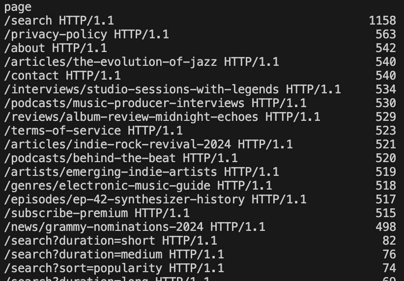

# Report

## Identification
Looking at the IPs that sent the most requests in the log period, we can see that the top 16 appear to be abnormally high; some are also very similar to each other:

What we first found suspicious was that all of the requests from the 3rd most active IP were all made consecutively looking at the raw log file. They also seemed to ocurr within an exact; 30-minute time period starting from the hour:

Though this is certainly bot behaviour, it's possible that this may be a result of a kind of stress test on the server rather than malicious outside traffic. Bu that of course depends on how the comapny operates.

For the 194 IPs, we the following were the most visited:

These appear to line up with some but not all of the most visited pages in the full period, the top 24 of which are abnormally higher than the rest:

Looking into what IPs were visiting these pages, we indeed found the 194 IPs:

This unusual spread of pages being visited (e.g. a specific "episode" being viewed) does suggest that this may be external bot behaviour unnecessaraly taking up company resources.

However, the most concerning behaviour found was from the 185 ips which appeared to all be tryig to log into an admin page via brute force:

This of course indicates an atempted attack on the site.

## Solutions

Upon research, traditional defences against unwanted bad bot behaviour is the use of CAPTCHAs and Web App Firewalls. However, these two methods are becoming less and less effective as bots have only evolved to work around them since their adopted use.

More specifically, using CAPTCHAs runs the risk of negatively affect the User Experience or even accessibility and data privacy compliance. WAFs, on the other hand, rely on the blocked IPs being *consistently* used by bad bots; they run the risk of blokcing good bots or at worst, legitamate users.

There are more advanced bot detection software available; however, these tend to be paid services. Machine learning may even be used bu this would obviously be very expensive to set up and use, both time and money wise.

As for protecting the admin accounts, Multi-Factor Authentication appears to be a reasonable solution. These often need to be manually set up by the user and can thus affect UX, but it's possible that this could only be used by admins.

Either way, MFA doesn't reduce website traffic. For that, a "lockout" system that locks the user out when they fail to log in enough times may be of better help. Although again, this may affect UX.

## Bibliography
- Bot detection articles
    - https://datadome.co/guides/bot-protection/bot-detection-how-to-identify-bot-traffic-to-your-website/
    - https://www.arkoselabs.com/blog/blog-how-to-distinguish-bot-vs-human-traffic/
- Log format
    - https://edgedelta.com/company/blog/log-types-and-formats
